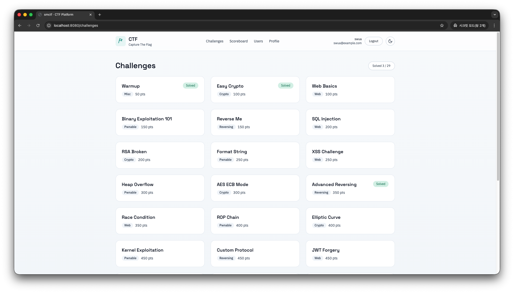
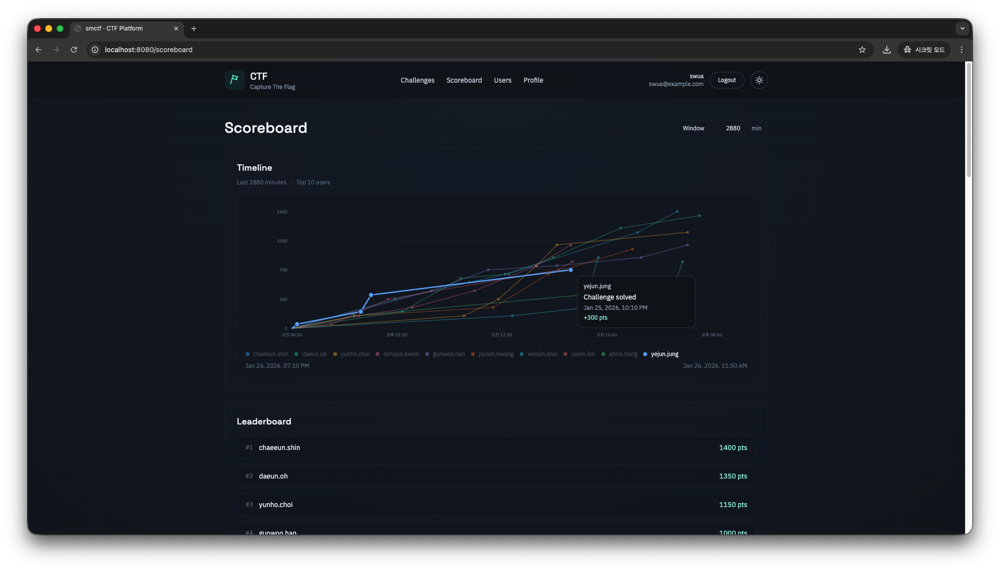
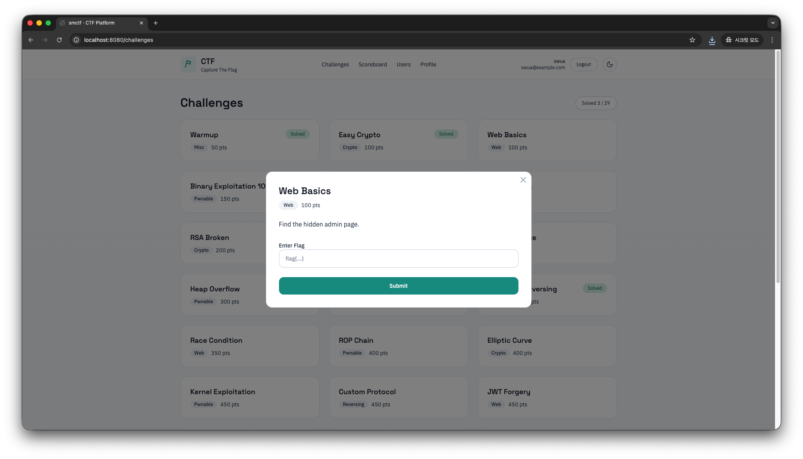
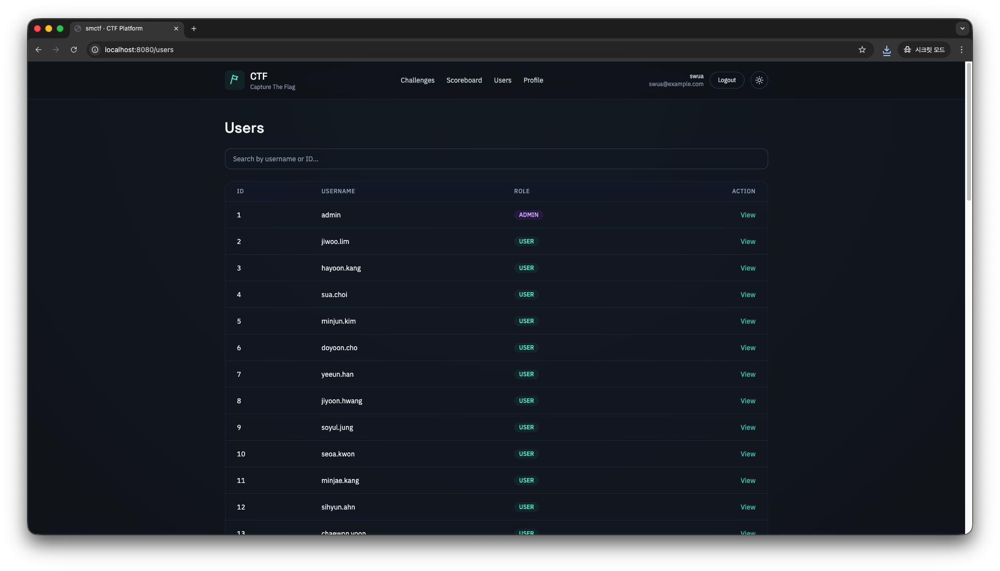
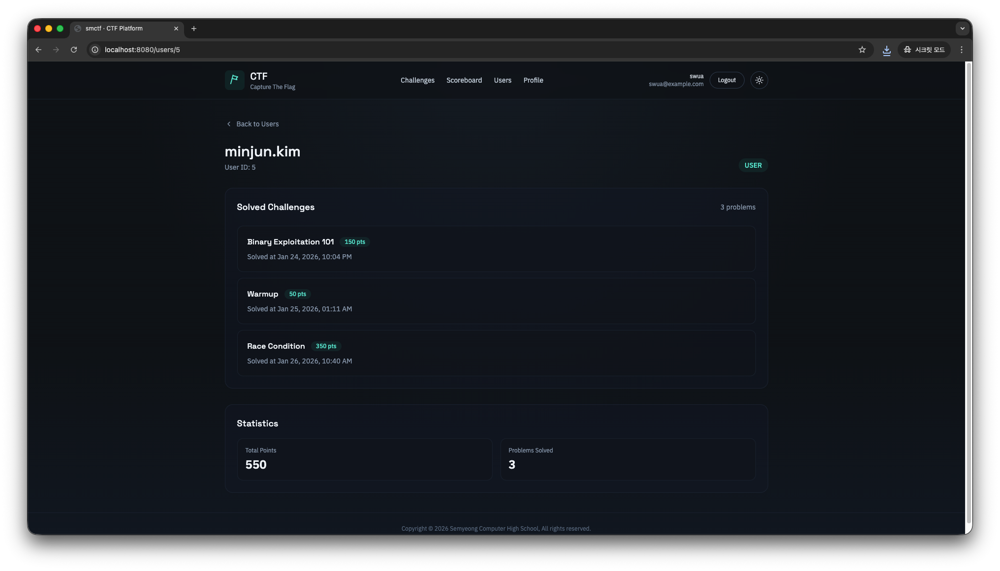
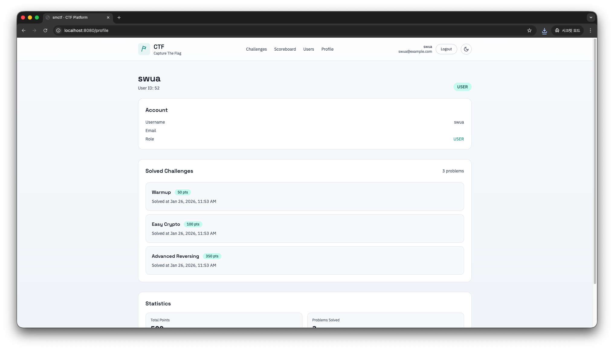
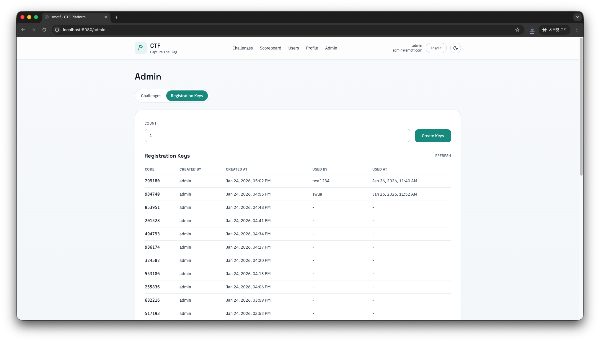

## SMCTF: CTF Platform for everyone, specialized for SMCH[^1]

<div align="center">
    
    
</div>

## Installation and Usage

See [`/docs`](./docs) for more details. This README only provides a quick start guide.

> [!NOTE]
> 
> PostgreSQL and Redis are required. if necessary, use Docker to run them locally.
> 
> ```shell
> docker compose -f docker-compose.db.yaml up -d
> ```
> 
> If you need a remote DB server, refer to the configuration values ​​in [docker-compose.db.yaml](./docker-compose.db.yaml).
> tables, indexes, etc. will be automatically migrated when the server starts.

```shell
git clone https://github.com/nullforu/smctf.git
cd smctf

touch .env
```

And add the following environment variables to `.env` file (refer to [`.env.example`](.env.example)):

```ini
# App
APP_ENV=local
HTTP_ADDR=:8080
SHUTDOWN_TIMEOUT=10s
AUTO_MIGRATE=true
BCRYPT_COST=12

# PostgreSQL
DB_HOST=localhost
DB_PORT=5432
DB_USER=app_user
DB_PASSWORD=app_password
DB_NAME=app_db
DB_SSLMODE=disable
DB_MAX_OPEN_CONNS=25
DB_MAX_IDLE_CONNS=10
DB_CONN_MAX_LIFETIME=30m

# Redis
REDIS_ADDR=localhost:6379
REDIS_PASSWORD=
REDIS_DB=0
REDIS_POOL_SIZE=20

# JWT
JWT_SECRET=change-me
JWT_ISSUER=smctf
JWT_ACCESS_TTL=24h
JWT_REFRESH_TTL=168h

# Security
FLAG_HMAC_SECRET=change-me-too
SUBMIT_WINDOW=1m
SUBMIT_MAX=10

# Cache
TIMELINE_CACHE_TTL=60s
```

> [!IMPORTANT]  
> 
> Make sure to change `JWT_SECRET` and `FLAG_HMAC_SECRET` to secure random strings in production!

After setting up the environment variables, build and run the server:

```shell
cd frontend
npm install && npm run build
cd ..

go build -o smctf ./cmd/server
./smctf

# or: go run ./cmd/server
```

> [!NOTE]  
> 
> Running in Docker environment will be supported in the future. 
> Currently, please use local installation for development and testing. Requires Go and NodeJS, NPM installation.

## Previews

<div align="center">
    
    
</div>

<div align="center">
    
    
</div>

<div align="center">
    
</div>

## Contributors

- [@yulmwu](https://github.com/yulmwu) - Main maintainer
- and more [Null4U](https://github.com/nullforu) members...

## About SMCTF (Some excerpts)

```diff
> 백엔드 언어를 굳이 Go를 선택한 이유?

< 1. 기존에 쓰던 NodeJS의 NestJS 프레임워크는 너무 무거웠음
< (DI, 복잡한 구조와 런타임 데코레이터, 많은 빌트인 기능으로 인해 무겁고 운영상의 오버헤드가 있었음)

< 2. 그렇다고 가벼운 ExpressJS 프레임워크는 너무 자유로워서 유지보수가 어렵다고 판단함
< Fastify도 고려했으나 익숙하지 않았음

< 3. 백엔드 개발을 위한 언어/런타임 중 수준있게 다룰 수 있는 언어/런타임이 사실상 NodeJS와 Go 언어밖에 없었음
< (Python, Ruby, Java 등은 개인적으로 선호하지 않음)>

< 4. Go 언어는 컴파일링을 거치면 단일 바이너리로 배포 가능, 
< (이론상) 빠름, 정적 타이핑, 쉬운 문법, 나름 생태계가 갖춰짐, 러닝 커브가 완만함
< Go를 처음 접했을 2019년 당시엔 Go 언어의 생태계가 부족하다고 판단하였으나, 현재는 어느정도 갖춰진 상태라고 판단하였음
< + 거기에 E2E TDD 관련 툴들도 나름 잘 갖춰져 있었음 (특히 testcontainers 등)

< 5. Gin, Fiber, Echo 등의 여러 웹 프레임워크가 있었으나 생태계가 가장 크고 안정적인 Gin 프레임워크를 선택함

< 6. ORM도 여러 후보를 고려했었으나 최종적으로 Bun을 선택하였음
```

```diff
> 프론트엔드 프레임워크를 기존에 쓰던 React에서 Svelte로 바꾼 이유?

< 1. React도 마찬가지로 너무 무거웠음 (의존성이 너무 많고 최종적으로 서빙되는 번들 크기가 좀 큰 듯)

< 2. Svelte는 컴파일 타임에 대부분의 작업이 처리되기 때문에 런타임 오버헤드가 적고,
< 결과물인 번들 크기가 작아지는 경향이 있음
< + 거기에 그냥 써보고 싶었음 (5.0의 Rune 기능이 궁금했음)
```

> \- 프로젝트의 유일 메인테이너이자 동아리 부장 [@yulmwu](https://github.com/yulmwu) 발췌 \-
> 
> 이거 유지보수할 사람이 하나밖에 없는게 단점.. Null4U에 종속시키고 졸업할 예정이니 후배님들이 알아서 잘 배워서 유지보수 해주길 바람.

[^1]: SMCH: Semyeong Computer High School (세명컴퓨터고등학교)
